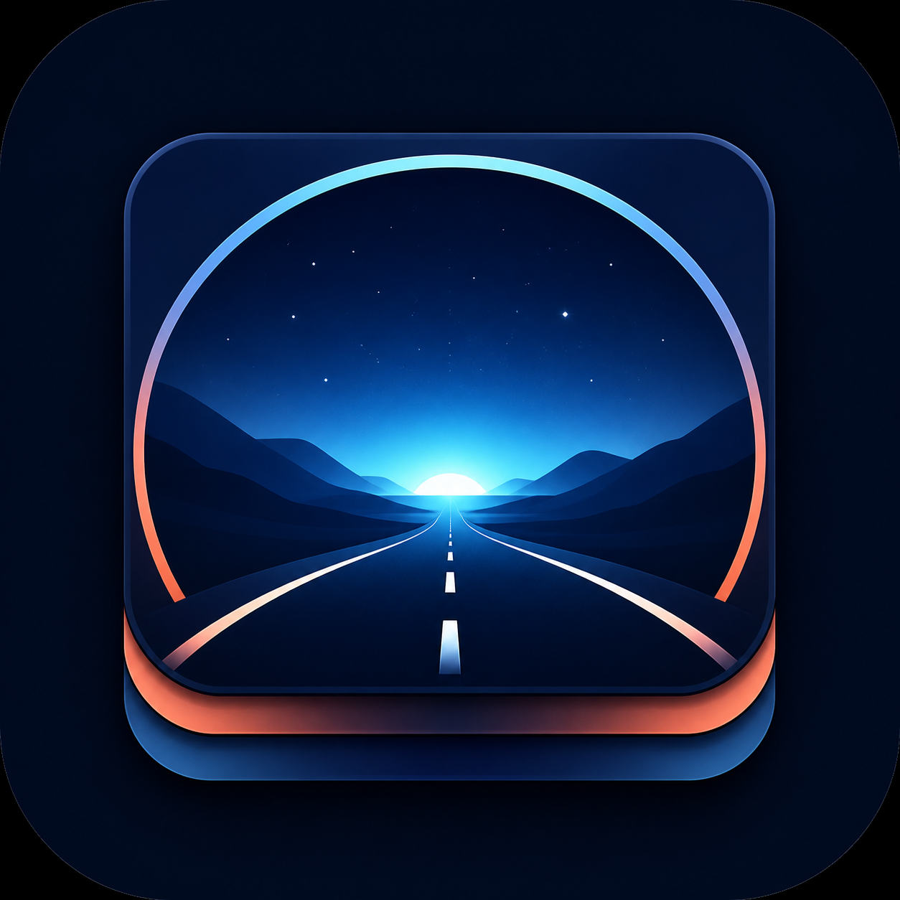
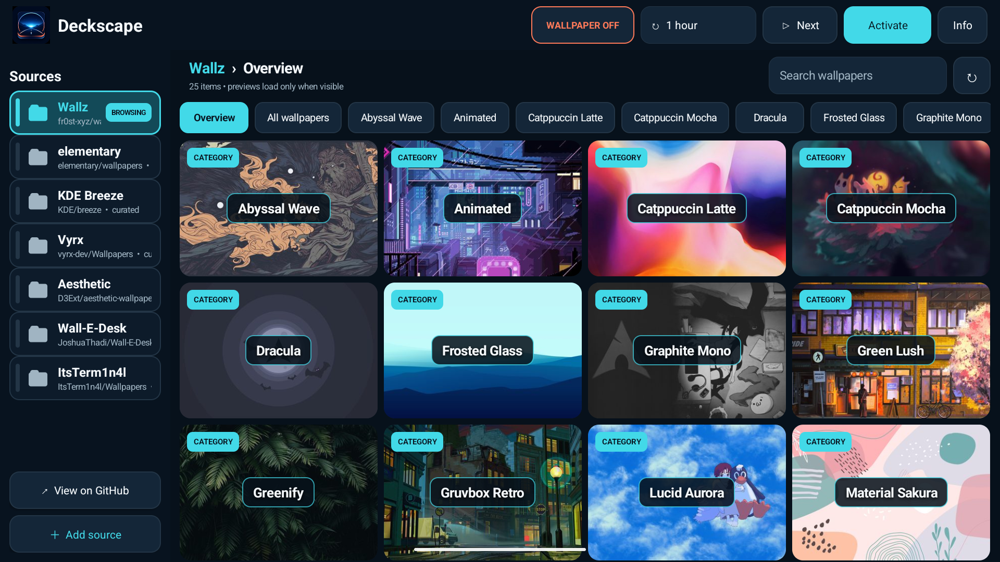
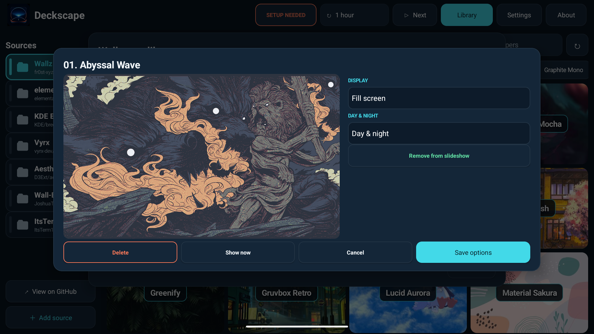
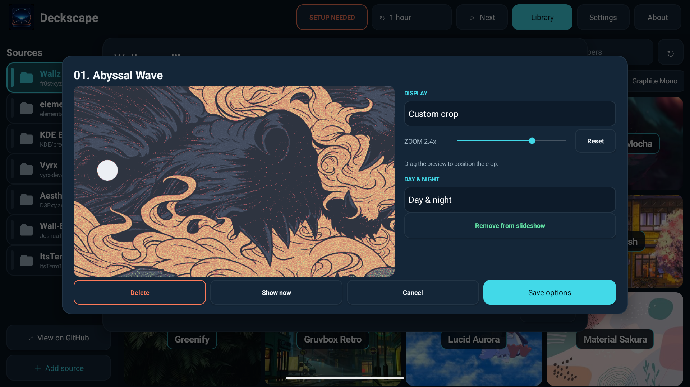
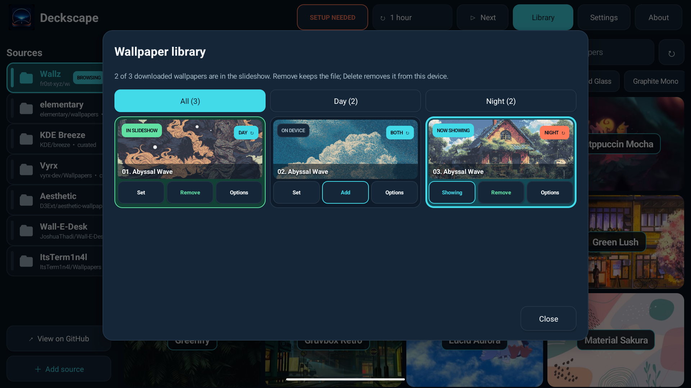
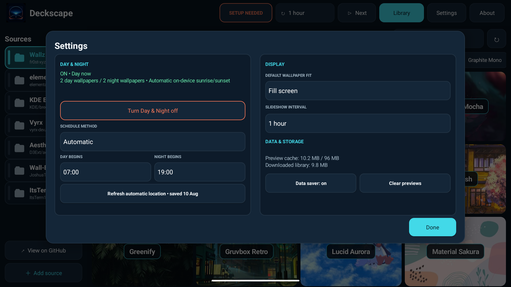
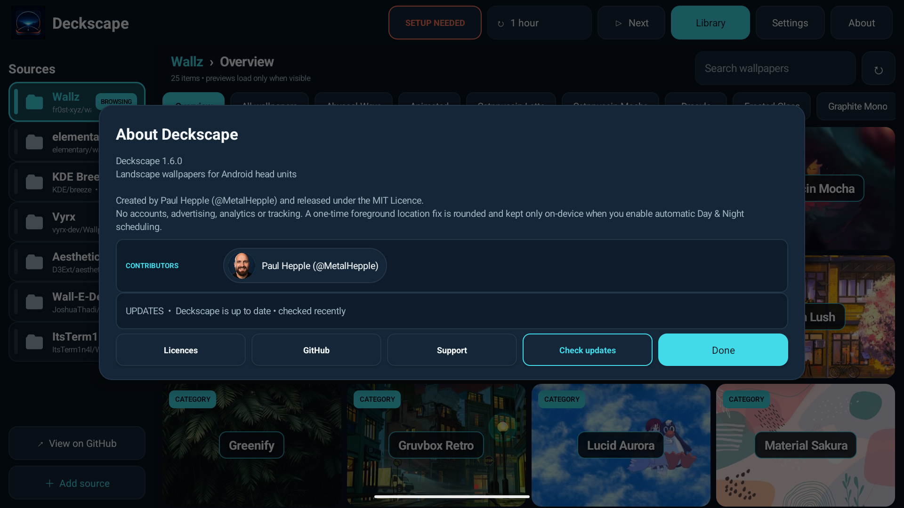

<p align="center">
  
</p>

<h1 align="center">Deckscape</h1>

<p align="center">
  A fast, landscape-first wallpaper gallery for Android displays.
</p>

<p align="center">
  <a href="https://github.com/MetalHepple/Deckscape/actions/workflows/android.yml"></a>
  <a href="https://github.com/MetalHepple/Deckscape/releases/latest"></a>
  
  <a href="LICENSE"></a>
  
</p>

Deckscape browses public GitHub wallpaper repositories without bundling their
artwork. Repository folders become visual categories, previews are generated
and cached on the device, and a selected static image or animated GIF is shown
through Android's standard live-wallpaper service. Each download can be fitted,
filled, stretched, or cropped for the display, and optional Day & Night pools
can change the scene automatically.

The interface is designed for touch-operated 16:9 Android head units, but the
app contains no vehicle-maker APIs or branding. It can run on other Android 9+
devices that support live wallpapers and allow APK installation.

## Download

<p align="center">
  <a href="https://github.com/MetalHepple/Deckscape/releases/latest/download/Deckscape-1.7.3.apk"><strong>Download Deckscape 1.7.3 APK</strong></a>
</p>

The signed APK supports Android 9 (API 28) and newer. Download it directly from
the [latest GitHub release](https://github.com/MetalHepple/Deckscape/releases/latest),
then open it on the Android device and approve installation from that source if
prompted.

The release page includes a SHA-256 checksum alongside the APK so downloads can
be verified independently.

See [CHANGELOG.md](CHANGELOG.md) for changes since the first public release.

Android owns the final live-wallpaper confirmation step. Existing installations
can be updated in place with later Deckscape releases from this repository.

### App updates

Deckscape checks this repository's latest stable release at most once per day
while the app is open. When a newer version is available, its small APK is
downloaded automatically over any available internet connection, including
metered or mobile-data connections. The app never installs an update silently:
open **Update** and press **Install update**, then approve Android's ordinary
package-installer screens.

Before offering the install, Deckscape verifies the release asset's SHA-256,
package name, version, and signing certificate. Android may require Deckscape
to be allowed as an installation source the first time. Deckscape hands the
verified APK directly to Android's package installer so vendor head units that
do not implement the standard per-app source-settings screen can still apply
their own installation policy. If a device blocks that installer too, use the
**Release page** action and install the APK through its browser or file manager.
Some head units revert to their stock wallpaper while an app update is
installed; if that happens, open Deckscape and activate its live wallpaper
again.

## Screenshots

<table>
  <tr>
    <td></td>
    <td></td>
  </tr>
  <tr>
    <td align="center"><strong>Image-backed categories</strong></td>
    <td align="center"><strong>Fit, role, slideshow, and device controls</strong></td>
  </tr>
  <tr>
    <td></td>
    <td></td>
  </tr>
  <tr>
    <td align="center"><strong>Touch-controlled crop and zoom</strong></td>
    <td align="center"><strong>Grouped Day & Night library</strong></td>
  </tr>
  <tr>
    <td></td>
    <td></td>
  </tr>
  <tr>
    <td align="center"><strong>Scheduling, display, and storage settings</strong></td>
    <td align="center"><strong>Version, contributors, licences, and updates</strong></td>
  </tr>
</table>

Screenshots use public catalog previews in an isolated emulator at the target
1920×1080, 240-dpi profile. They contain no vehicle, account, or location data.

## Features

- Large, landscape-first controls and a four-column wallpaper grid.
- Seven curated catalogs, with support for additional public GitHub repositories.
- Image-backed folder categories plus an optional recursive **All wallpapers** view.
- JPEG, PNG, WebP, and animated GIF wallpapers.
- Explicit **Get** and **Set** actions: Get stores the original without changing
  the wallpaper or slideshow; Set includes an on-device image and shows it.
- Download progress is shown inside the selected card or Preview action.
- Tap a wallpaper image or its **Preview** control to open a cached preview,
  then browse the current folder or search results with large previous/next
  controls and Get/Set actions.
- Animated GIFs play inside the in-app preview before installation.
- Clear **On device**, **In slideshow**, **Ready**, and **Now showing** states.
- Independent **Set**, **Add**, **Remove**, and confirmed **Delete** library
  controls, with All, Day, and Night views.
- Per-wallpaper **Fill**, **Fit**, **Stretch**, and touch-controlled **Custom crop**.
- One global display default for wallpapers without a custom choice.
- Optional Day & Night roles with automatic or manual changeover.
- Ambient-light scheduling on equipped devices, with local sunrise/sunset as a
  privacy-preserving fallback from a one-time foreground fix that is immediately
  rounded and kept only on-device.
- Manual, 1-minute, 1-hour, 6-hour, and 1-day rotation schedules.
- GIF playback capped at 10 fps and paused completely while hidden.
- Verified GitHub update checks with automatic downloads on Wi-Fi or mobile data.
- Friendly public GitHub contributor profiles with cached avatars, plus
  repository-level licence summaries.
- Bounded network, disk, decoder, and memory use suitable for head units.
- No account, analytics, advertising, background location, or storage permission.

## How previews work

GitHub exposes raw files rather than reduced wallpaper thumbnails. With **Data
saver** enabled, Deckscape requests a 480×270 JPEG from the open-source
[images.weserv.nl](https://github.com/weserv/images) service only when a card
becomes visible. The response is host-, type-, size-, and decoder-validated,
then retained in a bounded 96 MB on-device cache.

If the service is unavailable, Deckscape falls back to a separately bounded
download from the selected repository and generates the preview locally. Data
saver can be disabled and the preview cache cleared from **Settings**.

Opening an animated GIF preview fetches the validated original GIF within the
12 MB animation limit and stores it in the same bounded temporary cache. It is
not added to the local library unless **Get** is selected, and Get alone does
not change the wallpaper or slideshow.

Previous and next navigation follows a snapshot of the currently visible
wallpapers, including the active search filter, and skips category folders.

See [PRIVACY.md](PRIVACY.md) for the exact network destinations and stored data.

## Using the slideshow

**Get** downloads a wallpaper into Deckscape's private library without changing
the display or rotation. **Set** includes that on-device image in the slideshow
and makes it current without removing any other included wallpapers. **Remove**
takes an image out of rotation while keeping the download on the device;
**Add** restores it without another download. **Delete** permanently removes
the downloaded file after confirmation.

Use **Library** in the top bar to see the complete downloaded set, manage its
slideshow membership, and identify the current image. Its **All**, **Day**, and
**Night** views group assigned images without changing their stored roles;
**Both** images intentionally appear in Day and Night. The adjacent status pill
opens Deckscape's one-time activation guide when setup is needed.

For quick assignment, tap a wallpaper's role badge in Library to cycle
**Both → Day → Night → Both**. Use **Options** when you want to choose a role
directly alongside its display settings.

## Display and Day & Night options

Open **Options** on any downloaded wallpaper to choose how it fills the screen.
**Fill** removes bars by cropping evenly, **Fit** keeps the whole image visible,
and **Stretch** forces the source to the display shape. **Custom crop** adds a
live touch preview: drag to choose the focal point and use the slider to zoom.
The same transform is used for the in-app preview and live wallpaper renderer,
including animated GIFs.

The same panel can assign a wallpaper to **Both**, **Day**, or **Night**. Turn
the feature on from **Settings** after both periods have an eligible wallpaper.
In **Automatic** mode Deckscape uses the device's ambient-light sensor when one
exists. Otherwise it requests one foreground location fix and calculates local
sunrise and sunset on the device. Older or non-Google head units can require
Android's precise GPS permission to obtain that fix, but Deckscape immediately
rounds it to 0.1 degrees, discards the precise result, and never sends the saved
area to a server. Settings shows today's calculated sunrise and sunset as
read-only times in Automatic mode; editable fixed times appear only after
choosing **Manual times**. The one-minute search is cancellable. Choose Manual
mode to avoid location entirely or set a fixed schedule.

Manual **Set now** choices are respected until the next normal slideshow
interval. If removing or deleting a wallpaper empties either period, Day &
Night turns off safely instead of leaving the live wallpaper without a choice.

## Default catalogs

| Display name | Repository | Starting folder |
| --- | --- | --- |
| Wallz | [`fr0st-xyz/wallz`](https://github.com/fr0st-xyz/wallz) | repository root |
| elementary | [`elementary/wallpapers`](https://github.com/elementary/wallpapers) | `backgrounds` |
| KDE Breeze | [`KDE/breeze`](https://github.com/KDE/breeze) | `wallpapers/Next/contents` |
| Vyrx | [`vyrx-dev/Wallpapers`](https://github.com/vyrx-dev/Wallpapers) | repository root |
| Aesthetic | [`D3Ext/aesthetic-wallpapers`](https://github.com/D3Ext/aesthetic-wallpapers) | `images` |
| Wall-E-Desk | [`JoshuaThadi/Wall-E-Desk`](https://github.com/JoshuaThadi/Wall-E-Desk) | repository root |
| ItsTerm1n4l | [`ItsTerm1n4l/Wallpapers`](https://github.com/ItsTerm1n4l/Wallpapers) | `images` |

No wallpaper from these repositories is packaged in the APK. Wallpaper rights
remain with the respective creators and sources; review
[THIRD_PARTY_NOTICES.md](THIRD_PARTY_NOTICES.md) before redistributing artwork.

## Add a repository

Open **Add source** and enter one of the following:

```text
owner/repository
https://github.com/owner/repository
https://github.com/owner/repository/tree/branch/optional/folder
```

An additional starting folder and display name are optional. Only public
repositories are supported. Branch names containing `/` are not yet accepted.
Long-press a custom source to remove it; downloaded wallpapers remain local.

See [docs/SOURCE_FORMAT.md](docs/SOURCE_FORMAT.md) for validation and category rules.

## Build from source

Requirements:

- JDK 17
- Android SDK 36

Windows PowerShell:

```powershell
$env:ANDROID_HOME = "$env:LOCALAPPDATA\Android\Sdk"
$env:ANDROID_SDK_ROOT = $env:ANDROID_HOME
.\gradlew.bat --no-daemon testDebugUnitTest lintDebug assembleDebug
```

macOS or Linux:

```bash
./gradlew --no-daemon testDebugUnitTest lintDebug assembleDebug
```

The debug APK is created at
`app/build/outputs/apk/debug/app-debug.apk`. Install it with an explicitly
selected device serial:

```bash
adb -s DEVICE_SERIAL install -r app/build/outputs/apk/debug/app-debug.apk
```

Deckscape uses the application ID `uk.darkbyte.deckscape`. Release signing is
intentionally not stored in this repository; configure a private keystore in
your own release environment. Every published update must use the same release
signing key, be named `Deckscape-VERSION.apk`, and include a matching
`Deckscape-VERSION.apk.sha256` asset (or GitHub-provided SHA-256 digest).

## Architecture and safety

Deckscape uses Android framework views and networking without a large UI or
image-loading dependency. Downloads are reconstructed from validated repository
coordinates, restricted to HTTPS GitHub endpoints, streamed through byte caps,
and decoded before an atomic move into app-private storage.

Android owns wallpaper activation. Deckscape opens the ordinary live-wallpaper
confirmation screen and never modifies a manufacturer theme database. Configure
the app only while parked when it is used on a vehicle display.

Read [docs/ARCHITECTURE.md](docs/ARCHITECTURE.md) for component boundaries,
caching, and rendering details, and [SECURITY.md](SECURITY.md) for vulnerability
reporting.

## Repository layout

```text
app/          Android application and unit tests
brand/        Original app-icon source and image-generation provenance
docs/         Architecture, source-format documentation, and README images
.github/      CI, issue templates, and contribution metadata
```

Contributions are welcome. Start with [CONTRIBUTING.md](CONTRIBUTING.md), and
run the complete verification command before opening a pull request.

## Support Deckscape

Deckscape is free and open source. If you would like to support its development,
you can [buy me a coffee on Ko-fi](https://ko-fi.com/metalhepple). Donations are
entirely optional and do not unlock additional features.

## License

Deckscape source code and original project-specific brand assets are available
under the [MIT License](LICENSE). Downloaded or previewed wallpaper artwork is
not covered by that license.
