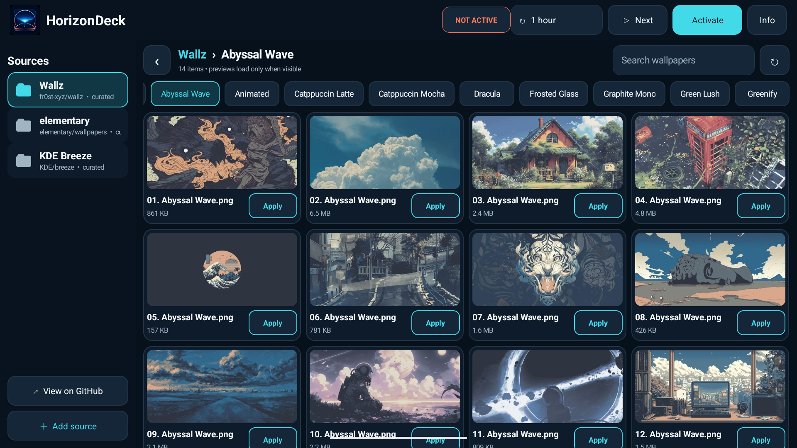

<p align="center">
  
</p>

# HorizonDeck

HorizonDeck is an open-source live-wallpaper gallery designed for landscape
Android head units. It browses public GitHub wallpaper repositories without
bundling their artwork, preserves repository folders as categories, builds
local thumbnail previews, and applies a selected static image or animated GIF
through an ordinary Android `WallpaperService`.

The first hardware target is a BYD DiLink 3.0 unit running Android 10, but the
app does not call private BYD APIs and is intended to remain useful on other
Android devices that support live wallpapers.

<p align="center">
  
</p>

## Highlights

- Landscape-first, four-column interface with large head-unit touch targets.
- Three curated sources with no bundled artwork: Wallz, elementary Wallpapers,
  and KDE Breeze.
- Add any public GitHub repository, branch, or starting folder.
- Repository folders appear as categories; **All wallpapers** builds a flat,
  recursive view only when requested.
- JPEG, PNG, WebP, and animated GIF support.
- One-touch **Apply** downloads, validates, selects, and applies an item. Android
  requires one system confirmation the first time the live wallpaper is used.
- Manual, 1-minute, 1-hour, 6-hour, and 1-day rotation schedules.
- GIF animation is capped at 10 fps and pauses completely while hidden.
- No account, analytics, location access, storage permission, or clear-text
  network traffic.

## Preview behaviour

GitHub's repository API returns file metadata and raw-file URLs, not reduced
wallpaper thumbnails. By default, HorizonDeck asks the open-source wsrv.nl
service for a 480×270 JPEG only when a card becomes visible, then retains it in
a bounded 96 MB on-device cache. This saves downloading a multi-megabyte source
just to draw a small card. If the service is unavailable, the app safely falls
back to downloading and resizing the source itself. **Info → Data saver** can
disable the service and use GitHub directly.

The catalog API cache is kept for two hours and can be used as an offline
fallback. GitHub's anonymous API limit still applies to uncached requests.

## Default sources

| Display name | GitHub repository | Starting folder |
| --- | --- | --- |
| Wallz | `fr0st-xyz/wallz` | repository root |
| elementary | `elementary/wallpapers` | `backgrounds` |
| KDE Breeze | `KDE/breeze` | `wallpapers/Next/contents` |

No files from these repositories are packaged in the APK. Each image remains
subject to its creator's and source repository's terms. See
[THIRD_PARTY_NOTICES.md](THIRD_PARTY_NOTICES.md).

## Add a repository

Use **+ Add repository** and enter either:

```text
owner/repository
https://github.com/owner/repository
https://github.com/owner/repository/tree/branch/optional/folder
```

An additional starting folder and display name are optional. Public
repositories and branch names without `/` are supported in version 1.0.
Long-press a custom source to remove it; downloaded wallpapers remain local.

More detail is in [docs/SOURCE_FORMAT.md](docs/SOURCE_FORMAT.md).

## Build

Requirements:

- JDK 17
- Android SDK 36

On Windows PowerShell:

```powershell
$env:ANDROID_HOME = "$env:LOCALAPPDATA\Android\Sdk"
$env:ANDROID_SDK_ROOT = $env:ANDROID_HOME
.\gradlew.bat test lintDebug assembleDebug
```

The debug APK is written to:

```text
app/build/outputs/apk/debug/app-debug.apk
```

The release build is deliberately not wired to a repository signing key.
Keep personal keystores outside Git and configure signing only in your private
release environment.

## Repository layout

```text
app/        Android application and tests
brand/      Original HorizonDeck icon source and provenance
docs/       Architecture and repository-source documentation
.github/    Continuous integration workflow
```

See [docs/ARCHITECTURE.md](docs/ARCHITECTURE.md) for the trust boundaries,
cache model, and live-wallpaper flow.

## Safety

HorizonDeck is intended to be configured while parked. It does not attempt to
bypass Android's live-wallpaper confirmation screen or modify a manufacturer's
private theme database. Wallpaper downloads are restricted to HTTPS raw files
from the repository the user selected, checked against size limits, and decoded
before being added to the local wallpaper library. Preview-service responses
are independently host, content-type, size, and decoder checked.

## License

HorizonDeck source code and original brand assets are licensed under the
[Apache License 2.0](LICENSE). Downloaded wallpaper artwork is not covered by
that license.
