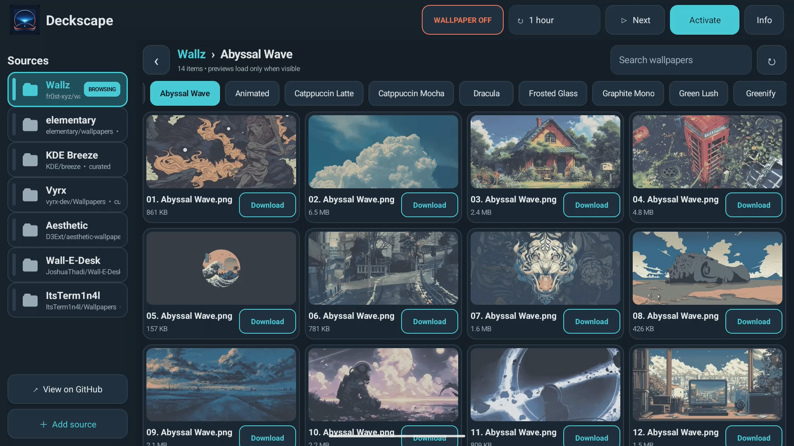
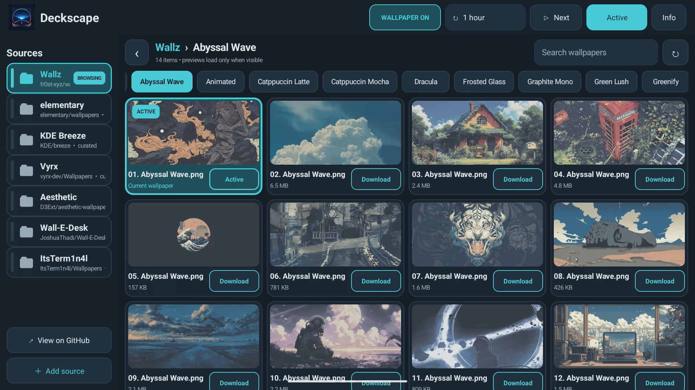

<p align="center">
  
</p>

<h1 align="center">Deckscape</h1>

<p align="center">
  A fast, landscape-first wallpaper gallery for Android displays.
</p>

<p align="center">
  <a href="https://github.com/MetalHepple/Deckscape/actions/workflows/android.yml"></a>
  
  <a href="LICENSE"></a>
  
</p>

Deckscape browses public GitHub wallpaper repositories without bundling their
artwork. Repository folders become visual categories, previews are generated
and cached on the device, and a selected static image or animated GIF is shown
through Android's standard live-wallpaper service.

The interface is designed for touch-operated 16:9 Android head units, but the
app contains no vehicle-maker APIs or branding. It can run on other Android 9+
devices that support live wallpapers and allow APK installation.

## Screenshots

<table>
  <tr>
    <td></td>
    <td></td>
  </tr>
  <tr>
    <td align="center"><strong>Image-backed categories</strong></td>
    <td align="center"><strong>Wallpaper browsing and one-touch downloads</strong></td>
  </tr>
</table>



Screenshots use public catalog previews in an isolated emulator at the target
1920×1080, 240-dpi profile. They contain no vehicle, account, or location data.

## Features

- Large, landscape-first controls and a four-column wallpaper grid.
- Seven curated catalogs, with support for additional public GitHub repositories.
- Image-backed folder categories plus an optional recursive **All wallpapers** view.
- JPEG, PNG, WebP, and animated GIF wallpapers.
- One-touch downloads with progress shown inside the selected card.
- Clear downloaded, selected, and active wallpaper states.
- Manual, 1-minute, 1-hour, 6-hour, and 1-day rotation schedules.
- GIF playback capped at 10 fps and paused completely while hidden.
- Bounded network, disk, decoder, and memory use suitable for head units.
- No account, analytics, advertising, location access, or storage permission.

## How previews work

GitHub exposes raw files rather than reduced wallpaper thumbnails. With **Data
saver** enabled, Deckscape requests a 480×270 JPEG from the open-source
[images.weserv.nl](https://github.com/weserv/images) service only when a card
becomes visible. The response is host-, type-, size-, and decoder-validated,
then retained in a bounded 96 MB on-device cache.

If the service is unavailable, Deckscape falls back to a separately bounded
download from the selected repository and generates the preview locally. Data
saver can be disabled and the preview cache cleared from **Info**.

See [PRIVACY.md](PRIVACY.md) for the exact network destinations and stored data.

## Default catalogs

| Display name | Repository | Starting folder |
| --- | --- | --- |
| Wallz | [`fr0st-xyz/wallz`](https://github.com/fr0st-xyz/wallz) | repository root |
| elementary | [`elementary/wallpapers`](https://github.com/elementary/wallpapers) | `backgrounds` |
| KDE Breeze | [`KDE/breeze`](https://github.com/KDE/breeze) | `wallpapers/Next/contents` |
| Vyrx | [`vyrx-dev/Wallpapers`](https://github.com/vyrx-dev/Wallpapers) | repository root |
| Aesthetic | [`D3Ext/aesthetic-wallpapers`](https://github.com/D3Ext/aesthetic-wallpapers) | `images` |
| Wall-E-Desk | [`JoshuaThadi/Wall-E-Desk`](https://github.com/JoshuaThadi/Wall-E-Desk) | repository root |
| ItsTerm1n4l | [`ItsTerm1n4l/Wallpapers`](https://github.com/ItsTerm1n4l/Wallpapers) | `images` |

No wallpaper from these repositories is packaged in the APK. Wallpaper rights
remain with the respective creators and sources; review
[THIRD_PARTY_NOTICES.md](THIRD_PARTY_NOTICES.md) before redistributing artwork.

## Add a repository

Open **Add source** and enter one of the following:

```text
owner/repository
https://github.com/owner/repository
https://github.com/owner/repository/tree/branch/optional/folder
```

An additional starting folder and display name are optional. Only public
repositories are supported. Branch names containing `/` are not yet accepted.
Long-press a custom source to remove it; downloaded wallpapers remain local.

See [docs/SOURCE_FORMAT.md](docs/SOURCE_FORMAT.md) for validation and category rules.

## Build from source

Requirements:

- JDK 17
- Android SDK 36

Windows PowerShell:

```powershell
$env:ANDROID_HOME = "$env:LOCALAPPDATA\Android\Sdk"
$env:ANDROID_SDK_ROOT = $env:ANDROID_HOME
.\gradlew.bat --no-daemon testDebugUnitTest lintDebug assembleDebug
```

macOS or Linux:

```bash
./gradlew --no-daemon testDebugUnitTest lintDebug assembleDebug
```

The debug APK is created at
`app/build/outputs/apk/debug/app-debug.apk`. Install it with an explicitly
selected device serial:

```bash
adb -s DEVICE_SERIAL install -r app/build/outputs/apk/debug/app-debug.apk
```

Deckscape uses the application ID `uk.darkbyte.deckscape`. Release signing is
intentionally not stored in this repository; configure a private keystore in
your own release environment.

## Architecture and safety

Deckscape uses Android framework views and networking without a large UI or
image-loading dependency. Downloads are reconstructed from validated repository
coordinates, restricted to HTTPS GitHub endpoints, streamed through byte caps,
and decoded before an atomic move into app-private storage.

Android owns wallpaper activation. Deckscape opens the ordinary live-wallpaper
confirmation screen and never modifies a manufacturer theme database. Configure
the app only while parked when it is used on a vehicle display.

Read [docs/ARCHITECTURE.md](docs/ARCHITECTURE.md) for component boundaries,
caching, and rendering details, and [SECURITY.md](SECURITY.md) for vulnerability
reporting.

## Repository layout

```text
app/          Android application and unit tests
brand/        Original app-icon source and image-generation provenance
docs/         Architecture, source-format documentation, and README images
.github/      CI, issue templates, and contribution metadata
```

Contributions are welcome. Start with [CONTRIBUTING.md](CONTRIBUTING.md), and
run the complete verification command before opening a pull request.

## License

Deckscape source code and original project-specific brand assets are available
under the [MIT License](LICENSE). Downloaded or previewed wallpaper artwork is
not covered by that license.
